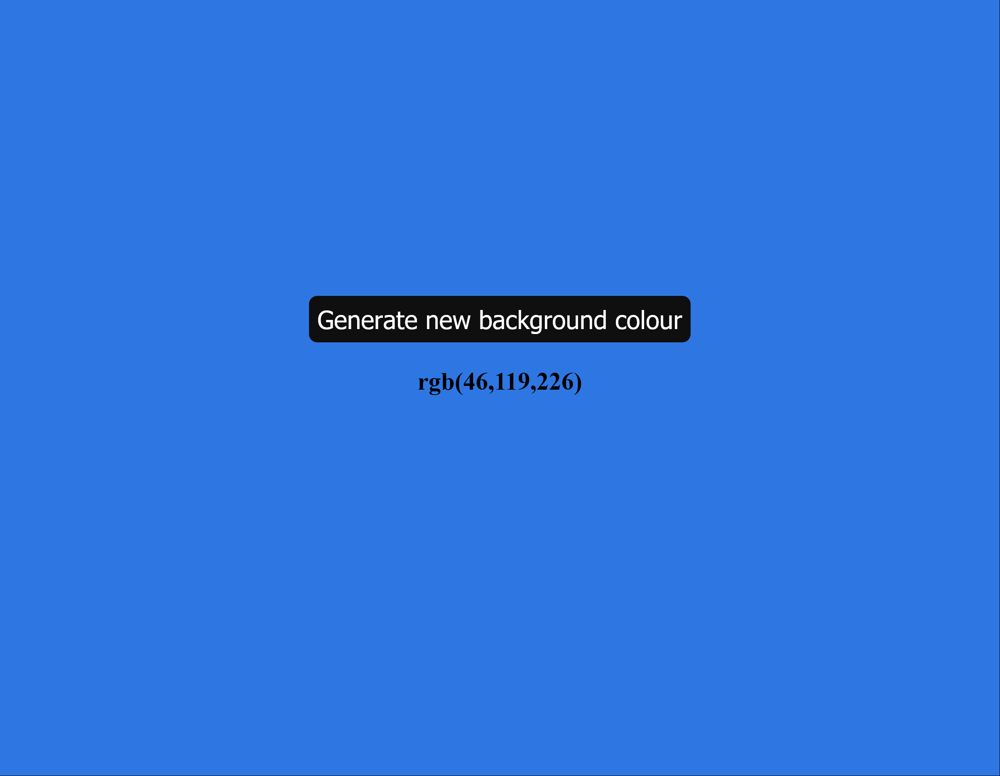

# js-change-background-colour-rgb
JS Challenge 2

Exercise 2 from the 100+ Javascript projects page (https://jsbeginners.com/javascript-projects-for-beginners/)

Changes the background colour to a random RGB value and displays that value on the page.

